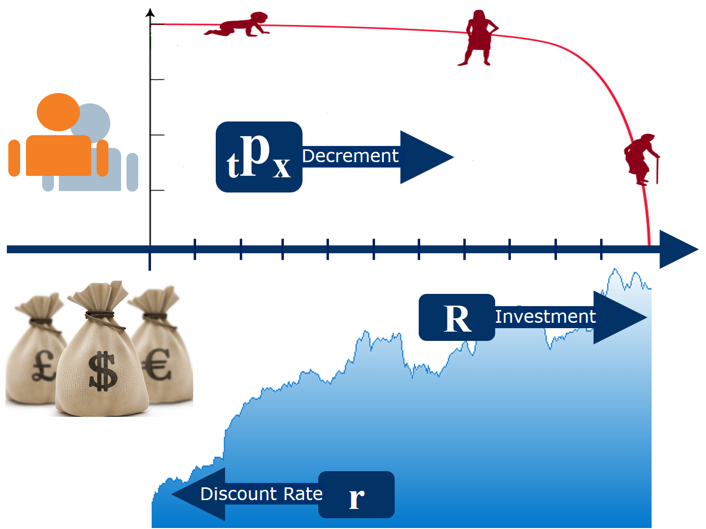
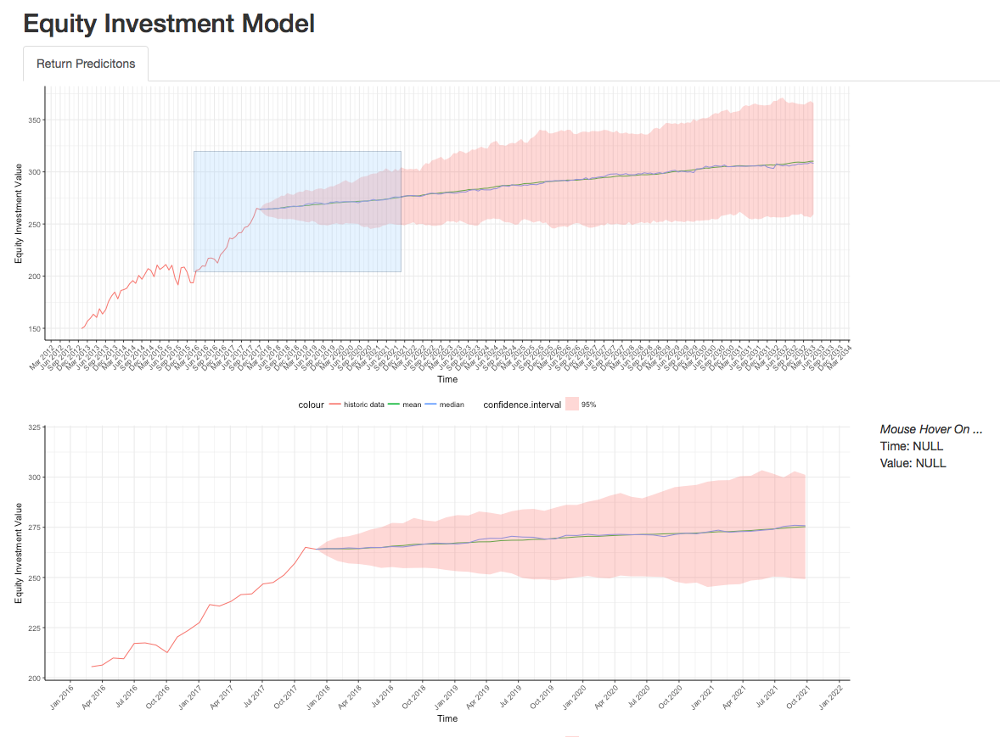
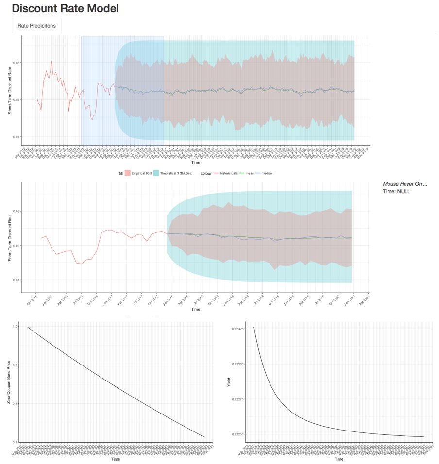

```{r setup, include = FALSE, echo = FALSE, message = FALSE, warning = FALSE}
package_list <- c("tidyverse", "knitr", "kableExtra")
lapply(package_list, require, character.only = TRUE)
opts_chunk$set(echo=TRUE, autodep=TRUE)
```

\newpage
# Project Info

## Project Title: Risk Analysis of Equity-Linked Insurance

## Group Members

| Name | NetID |
| ---- | ----- |
|Haoen Cui|hcui10|
|Peng Jin|pengjin2|
|Wayne Tao|gtao2|
|Dayu Yao|dayuyao2|
|Yuan Zhong|yzhong19|

## Project Scope

We got the idea from Prof. Runhuan Feng to build an R Shiny application for variable annuity (a type of insurance contract) pricing. We set up a broad plan for the application and implemented a majority of the desired functionalities during this semester. In particular, we analyzed the challenges of pricing such a long-term contract and decided to focus on three major sources of risks as well as simulation study. This project shall be extended after the semester ends and may turn into an educational tool for MATH 490 ELI section in the future. In the next few sections, we will tap into details of this project. Since this project is application-driven, main results mainly are included in the R Shiny deliverable section.   

---

# Variable Annuity Introduction

A variable annuity, like many other insurance products, is a contract between a policyholder and an insurance company, under which the policyholder agrees to make either a single purchase payment or a series of purchase payments. And the policyholder will receive a lump sum payment, annuitize accumulated asset base or begin taking regular withdrawals from sub-accounts. The premiums, or purchase payments from the policyholder are invested in a sub-account and the performance of this sub-account is linked in proportion to the equity index or equity fund in which it invests. For this reason, variable annuities can also be called equity-linked insurance.   
   
There are a wide range of variable annuity products on the market, our project is focused on the Guaranteed Minimum Death Benefit (GMDB). The GMDB is derived from some more basic insurance product such as traditional whole life insurance. Under traditional whole life insurance, a policyholder pays premium periodically (monthly, quarterly, semiannually, or annually), and a pre-determined death benefit goes to his beneficiary at the time of his death. The difference between GMDB and a traditional whole life insurance is that, for GMDB, the death benefit is generally equal to the greater of (a) a fixed amount specified on the contract or (b) premium payments invested in the market minus any prior withdrawals. The GMDB is attractive to both insurers and policyholders. The insurers could capture more capital gains in the stock market and the policyholders will keep up with the market to know their families will be protected against economic loss in the event of an untimely death.   
   
To price the GMDB product, we need to consider the three sources of risk, decrement risk, investment risk and discount rate risk. We illustrate how the three sources of risk affect the premium on the graph below:   
   

   
At time zero, there is a group of policyholders. The insurance company will charge the premiums and invest the money into a sub-account which linked to a stock. As we move forward, the number of policyholders will decrease. We will need to evaluate the decrement risk and simulate the number of remaining policyholders each year. Also, as the policyholders die, we need to take money out of the account to pay the death benefit while the remaining amount will stay in the account. Secondly, we need to simulate the stock performance based on the investment mode. We denote "R" as the performance of the underlying stock on the graph, which is also the performance of the account. Lastly, we need to model the discount rate, denoted by "r", to discount back the future cash flow. With the discount rate model, the insurance company can calculate the account value at each point on the timeline. Therefore, the insurers will be able to apply different premium principle to model the premium they need to charge to individual policyholders.  

---

# Risk Models

## Modeling Decrement: Mortality

In this project, we primarily concern about the risk of mortality under this source of risk. Let's define (x) as a life age at x, $T_{(x)}$ as the remaining life time random variable of (x), and $\mathbb{P}(T_{(x)}>t)$as the probability that a life (x) survive and extra t years, which can also be denoted by $_{t}p_{x}$.
To simulate the future life time of a policyholder, we need the continuous survival function. Once we have the continuous survival function, we could get the CDF and PDF. Then, we could apply the methods, such as inverse transformation and Accept-Reject. We will use a Life table to estimate the survival function. Below is a sample of Life Table:

x   | $l_{x}$ | $d_{x}$
:-: | :-----: | :-------------:
0   | 100000 | 637
1   | 99363 | 45 
2   | 99318 | 28

$l_x$ is the number of survivors at age x, and $d_x$ is the number of deaths during age x. The formula for the estimator for integral ages is $\widehat{_{t}p_x} = \frac{l_{x+t}}{l_x}$. Since Life Table is a discretized continuous model, we could use UDD assumption for fractional ages, which is to apply linear interpolation for fractional ages. Finally, we have a continuous survival model for any fractional age.


## Modeling Returns from Equity Investments

The equity investment return can be modeled in many different ways. First we need some period of historical stock performance data, which we can use to estimate the parameters and predict future return of that particular stock. Typically, Brownian Motion (both arithmetic and geometric) and time series forecasting methods (ARIMA, auto-regressive) are ways to help achieve this goal. In this project, have only implemented geometric Brownian motion. 
   
A geometric Brownian motion is a continuous stochastic process in which the logarithm of the randomly varying quantity follows a Brownian motion with drift. (from Wikipedia) It satisfies the following stochastic differential equation. 

$$\frac{dS_t}{S_t}=\mu dt+\sigma dW_t$$

$\mu$ represents the percentage drift and $\sigma$ represents the percentage volatility. This basically means that after infinitesimal time $dt$, the price $dS_t$ equals to $S_t$ times the drift and volatility factor. Solving this equation , we get:

$$\frac{S_t}{S_0} \sim \text{LogNorm}(\mu-\frac{1}{2}\sigma^2,\sigma)$$
In our case, $S_0$ denotes the last stock closing price of the training data and $S_t$ denotes the predicted stock closing price after t periods. The solution of the SDE indicates the  $\frac{S_t}{S_0}$ follows a log-normal distribution. 

Then we proceed to estimate the $\mu$ and $\sigma$ from historical data using maximum likelihood estimation (MLE). To ache hive this, we used `fitdistr` function from the `fitdistributionplus` package. After that we can use the known parameters to stimulate the stock paths.  

## Modeling (Risk-free) Discount Rates 

Just like the Equity Investment Return, there are a lot of models which we can utilize to predict future interest rate risk. Vasicek, Black-Derman-Toy, and Cox-Ingersoll-Ross are all very common models used to calibrate from historic data and project the future path of interest rates. However, again, due to time constraints, we only built one interest rate model featuring the classic Vasicek model. 

Vasicek Short Rate Model is a mathematical model describing the evolution of interest rates. (from Wikipedia) The model specifies the instantaneous interest rate follows stochastic differential equation shown below:

$$dr_t=a(b-r_t)dt+\sigma dW_t$$

solving the SDE, we can get $$r_t=r_0e^{-at}+b(1-e^{-at})+\sigma e^{-at} \int_0^t e^{as} dW_s$$
First and second central moments can be derived, $$\mathbb{E}[r_t]=r_0e^{-at}+b(1-e^{-at}), \space \space Var[r_t] = \frac{\sigma^2}{2a}(1-e^{-2at})$$ From these two expressions, we can tell that Vasicek model will result in a long term average $\lim_{t \rightarrow \infty} \mathbb{E}[r_t]=b$ and asymptotic constant variance $\lim_{t \rightarrow \infty} Var[r_t]=\frac{\sigma^2}{2a}$. 

---

# Methods Used

## Group 1: Random Number Generation

In our project, we constructed a random number generator that based on materials taught in class. Our random number generator can recognize three types of methods users intend to use: inverse CDF, accept-reject, and Metropolis-Hasting algorithm.   

Use cases include   

* Modeling Mortality: generate random samples for age-at-death random variable according to the life-table uploaded   
* Modeling Returns from Equity Investments: generate predicted paths of future equity returns according model specified and parameters estimated   
* Modeling (Risk-free) Discount Rates: generate predicted paths of future discount rates according model specified and parameters estimated   

## Group 2: Bootstrap

We used (but did not implement) bootstrap methods (regular bootstrap and jackknife) to estimate errors of estimators (mainly maximum likelihood estimators) and to estimate accuracy of distribution fit against historical data. 

## Group 2: Optimization

We used (but did not implement) numeric optimization methods to compute maximum likelihood estimators. In particular, we called functions to perform quasi-Newton methods (e.g. Broyden–Fletcher–Goldfarb–Shanno algorithm).  

---

# Deliverable: R Shiny Application

Our R Shiny application is hosted by shinyapps.io at [https://haoencuitest.shinyapps.io/eli_pricing/](https://haoencuitest.shinyapps.io/eli_pricing/). Due to limit of our free account, the app is only live for 25 computing hours per month. Alternatively, one can find the app in our [GitHub repository](https://github.com/pengjin2/STAT-428-Final-Project/tree/master/application). The empirical life table for demonstration is stored in the [/data folder](https://github.com/pengjin2/STAT-428-Final-Project/blob/master/application/data/Empirical%20Life%20Table.csv). Below are some screenshots.  
   


The life table uploaded is printed on the top. Users can use the filters to explore the table. At the bottom, we have a plot for average number of remaining lives. Users can hover the mouse over the graph to find out the precise coordinates.   



This section illustrates our predictions of equity returns. users can drag a blue box over the first plot and second plot will zoom in or out accordingly. Also, users can hover their mouse over the zoomed plot to find out the precise coordinates.   



The layout usage here is very similar to that for equity return modeling section. In addition, two more plots are generated at the bottom to show projected zero-coupon bond price and yield curve.   

---

# Future Work

Some of the project team members plan to continue working on this project under Prof. Feng. Our next steps will involve  

* Visualize or report errors of parameter estimation   
* Add more models for each risk source   

    + Decrement: Lapse, Annuitization   
    + Equity Investment: ARIMA   
    + Interest Rate: ARIMA, Black-Derman-Toy, Cox–Ingersoll–Ross   
    
* Complete profit testing section   
* Incorporate premium calculation functions   
* If possible, functions for back-testing and rolling calibration   

Note that additional work may start sometime after the final week. GitHub repositories will be updated after the continuing work starts. A copy of the entire GitHub repository as of the project due date is included in the zip file.   

---

# Appendix {-}

## Data Source  {-}

### Life Table Data {-}

The data used for demo was downloaded from The Human Mortality Database, a nonprofit organization that provides mortality data for researchers, students, and policy analysts. There are 39 countries' data available on the website, but this project is mainly focused on the USA.

### Equity Price and Interest Rate Data {-}

We used `quantmod::getSymbol` API to download data. Sources are specified by users. By default, equity data are downloaded from Yahoo! Finance while interest rate data are downloaded from FRED database. 

## Codebase {-}

Main repository for this project is hosted on GitHub at [https://github.com/pengjin2/STAT-428-Final-Project](https://github.com/pengjin2/STAT-428-Final-Project). In particular, the code base is at [/application](https://github.com/pengjin2/STAT-428-Final-Project/tree/master/application).   
   
Functions programmed for **decrement modeling**: 
```{r, echo = FALSE}
NCmisc::list.functions.in.file("../application/decrement.R")$`character(0)`
```
   
Functions programmed for **equity investment modeling**: 
```{r, echo = FALSE}
NCmisc::list.functions.in.file("../application/investment.R")$`character(0)`
```
   
Functions programmed for **discount rate modeling**: 
```{r, echo = FALSE}
NCmisc::list.functions.in.file("../application/discount rate.R")$`character(0)`
```
   
Self-implemented **random number generator**: 
```{r, echo = FALSE}
NCmisc::list.functions.in.file("../application/discount rate.R")$`character(0)`
```

